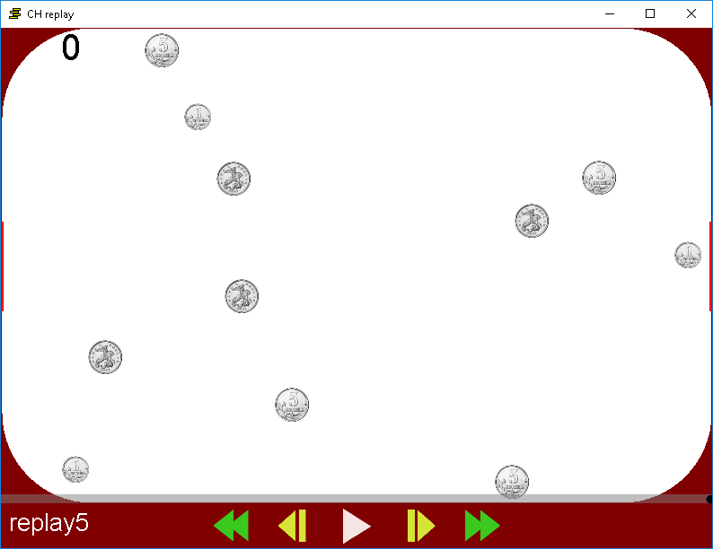

# CHreplay
Вы забили гол от двух рикошетов или сделали другую (как вы считаете) невероятную вещь. Хотите похвастаться, но вам никто не верит. 
Да, тот гол потерян. Зато следующие можно будет записать и прочитать при помощи этой программы.

[Сама игра](https://github.com/prifio/coins_hockey)

#Работа с программой
## Установка
Установка аналогично как и в самой игры. Но можете просто откопировать CHreplay.exe в папку игры. Потом один раз запустите CHreply.exe
После его можно сразу выключить.

##Подготовка
Запишите replay (подробней читайте в описании самой игры). Потом запустите файл с вашим replay. Файл CH.ico имеет такую же иконку, как и файлы c вашими replays. Но это не replay, его не надо запускать.

##Пользование
Внизу есть 5 кнопок. Две боковые - перемотать на 1.5 секунды. Две ближе к середине - ускорить/замедлить воспроизведение. Средняя кнопка - продолжить/остановить воспроизведение. Есть ещё полоса прокрутки. Бегунок можно двигать, тем самым точно задав момент игры.

##Сочетания клавиш
Продолжают работать сочетания клавишь
+ Пауза - P(pause) или Space(пробел)
+ Ускорить - F(fast)
+ Замедлить - S(slow)
+ Промотать вперёд - N(next)
+ Промотать назад - A(ago)

Приятной игры и просмотра!
